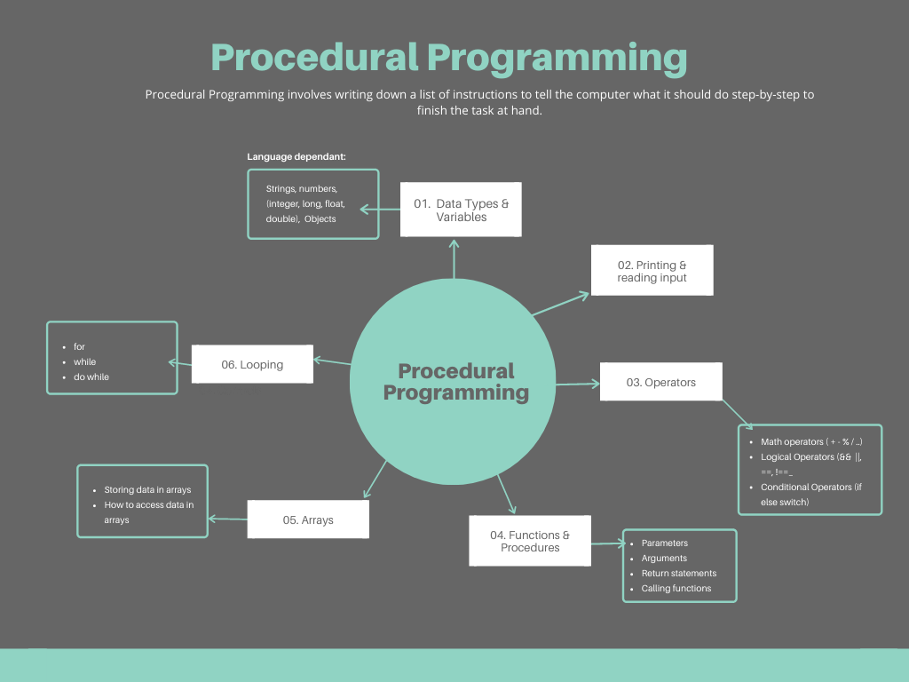
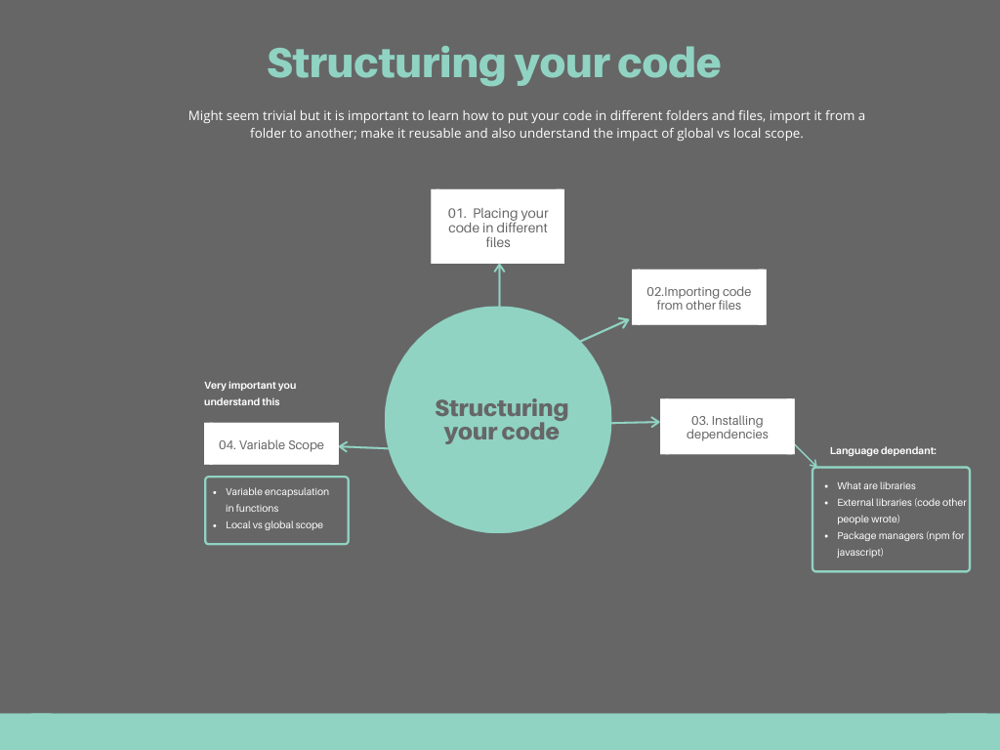
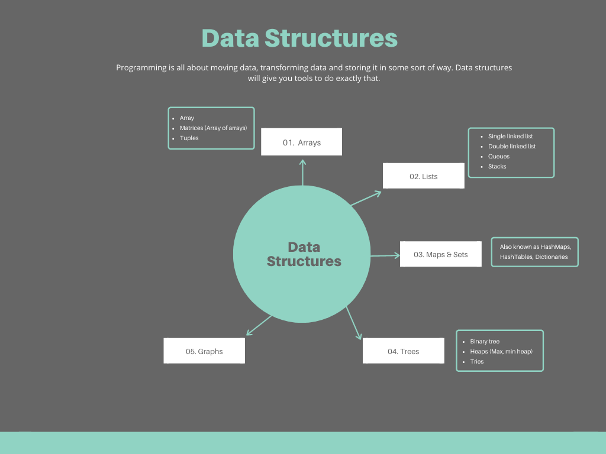

Starting something new can be really hard specially when __you don't know what you don't know__.
Based on what I know from working day in and out writing code for years, I wanted to put
together something that might give some guidance to new developers in terms of what they
should focus on.

So here is my take on how I would start learning and why I believe this is the order in which you
should pursue knowledge.


#### Understand what you are getting into

> Goal: Understand that programming is not as hard as solving complex math problems with
derivatives and integrals, but not as simple as building a _Wix_ website


<aside>
Yes, there can be some really complex things but you don't need them to get started. With time
you will learn them.
</aside>


#### Procedural Imperative Programming

> Goal: Learn how to write procedures and small scripts (small files with code that do something in specific),
understand how to actually do stuff with a programming language.



<aside>
  Which programming language should I learn?: Javascript (just kidding, just pick one and stick with it, it
  doesn't matter if you use python or java or c#, or go)
</aside>

Once you learn those concepts, you should be able to understand and write something like the code below
which is very procedural, but will demonstrate you know how to use the basic features that 
almost every single programming language support.

```javascript
// Imperative procedural code. This might be how your 
// code might look like at this point

function fizzBuzz(value) {
  if (value % 3 === 0) {
    console.log('fizz')
  } else if (value % 5 === 0) {
    console.log('buzz')
  } else if (value % 3 === 0 && value % 5 === 0) {
    console.log('fizzbuzz')
  }
}

allValues = [1,2,3,4,5,6,8,9,10]

for (var i =0; i <= allValues.length; i = i + 1) {
  fizzBuzz(allValues[i])
}
```

#### Structuring your code

> Goal: Structure your code by files; learn that where you place variables matter.



Once you understand those concepts, you should be able to answer why `counterOne`
in the code below keeps incrementing and `counterTwo` never increases.

```javascript

//  ----- file_1.js -----
var counter = 0

export function countOne() {
  conter = counter + 1
  console.warn(counter)
}

// ---------------------------------------

//  ----- file_2.js -----
import {countOne} from './file_1.js'

function countTwo() {
  var counter = 0
  counter = counter + 2
  console.warn(counter)
}

countOne() // output: 1
countOne() // output: 2
countOne() // output: 3

countTwo() // output: 2
countTwo() // output: 2
countTwo() // output: 2
```

#### Data Structures

> Goal: Understand how to organize and structure data



<aside>
It is ok if you don't know all of them to perfection, but knowing they exist and what each one is useful for is important.
</aside>

If you were tasked with something like 

>"I want to be able to look up a person's phone number by their first name"

```javascript
 // You could use a an array of arrays
 var directory = [
  ['nelson', 123456789],
  ['bob',    222222222],
  ['pete',   111111111]
]

// But  after learning data structures, you will know there are
// better ways of organizing that data using structures like hashmaps
var directory = new Map()
directory.set('nelson', 123456789)
directory.set('bob',    222222222)
directory.set('pete',   111111111)
```

---

## Test your knowledge

To test if you are good at this point __you should do some of the BASIC to mid level problems in Hacker Rank or Leet Code__.
Some of the exercises will push you to do some research and learn some classic algorithms like bubble sort, merge sort, insertion sort and might even ask you to implement a data structure like a list or a queue or a binary tree.

[HackerRank](https://www.hackerrank.com/) or
[LeetCode](https://leetcode.com/)

##### Why should you care?

A lot of companies interviewing will ask candidates questions related to the topics
mentioned here and maybe they will make you write some code and solve something like the `fizzbuzz`.

