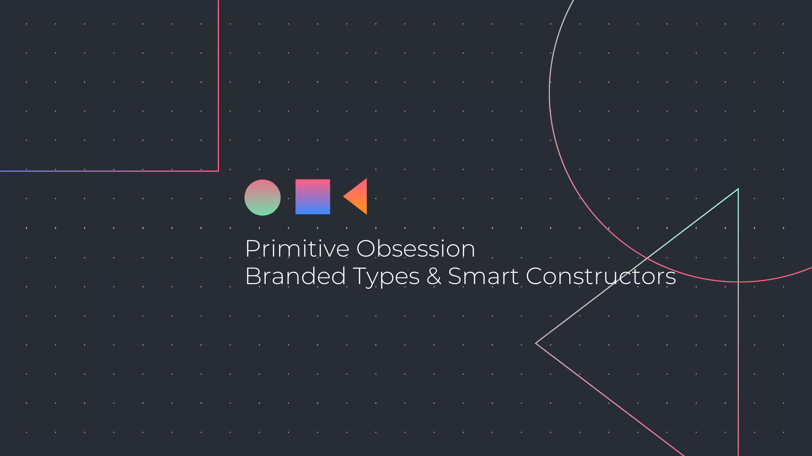

</br>
</br>



</br>
</br>
</br>

Let me ask you something. What is the problem with the code below?

```typescript
const calculatePaymentAmount = (amount: number, gstPercent: number): number =>
  amount * (1 + gstPercent)
```

</br>

It might seem totally fine if I call `calculateTotalPaymentAmount(10, 0.05)` I will get what I expect which is **10.5**. The problem with it is you only know that because you wrote that function. You probably know that amount should be a non negative value, you might also know that gstPercent should be a value between 0 and 1 and the return value is some sort of dollar amount. The function is not giving any sort of information which means you will have to go and check the implementation.

1. How would you know that amount actually represents something like `CAD` dollars and not some other type of currency denomination like Venezuelan Bolivares?
2. How could you gurantee that you are calling the function with a value that represents an actual precentage?
3. How could you gurantee you will always get a positive number and not some oddity like a negative value (currency can't be negative right?)

Still... you could break this code pretty easily by doing any of the things displayed below and the compiler (if you are using Typescript) will happily comply. (This would also apply for any language with no support for type checks or compile time checks)

```typescript
const bolivares = 1000000000
// This is wrong becase I don't want to accept bolivares
calculatePaymentAmount(bolivares, 0.05)

// Thisnegative payment amount
calculatePaymentAmount(-10, 0.05)
// This returns negative payment amount
calculatePaymentAmount(10, -1.05)
// This will result in an incredibly high number if someone is only
// paying 10$
calculatePaymentAmount(10, 100)

// This returns Infinity
calculateTotalPaymentAmount(10, Infinity)
```

I have written code like the one above in the past, and if you have code like that in a bunch of places then you are

> Primitively Obssesed

Primitive obsession is a code smell, in which you rely too heavily on primitive types and as demonstrated on the example above, there are several bugs you could potentially introduce and only find during runtime (which could be in production).

> Addressing the elephant in the room

We could begin improving the code by doing the following

```typescript
type CAD = number
type Percentage = number

const calculatePaymentAmount = (dollars: CAD, gst: Percentage): CAD =>
  amount * (1 + gstPercent)
```

</br>

Now our function gives us some extra information, but still nothing is preventing you from calling the function with any number, since we are just using type aliases for number. We could use something a little more sophisticated than a type alias to tell the compiler that CAD or percentage are not simply type aliases.

> Branded types

Branded types are essentially tags or brands that we put on primitives that add some extra information.

```typescript
interface Brand<A extends string> {
  brand_: A
}

type CAD = number & Brand<"CAD">
type Percentage = number & Brand<"Percentage">
```

</br>

If we just did that, now CAD is not simply a number. The type now contains some extra information that we will require. The code below won't compile now.

```typescript
calculateTotalPaymentAmount(10, 0.05)
```

</br>

Now, we need a way of forcing our invariants on the **branded types** we just created. To do that, we can use something called **smart constructors**. They are special functions that will create our types.

```typescript
const makeCAD = (amount: number): amount is CAD => {
  if (!(amount > 0)) {
    throw `CAD can't be negative`
  }

  return amount as CAD
}

const makePercent = (percent: number): Percentage => {
  if (!(percent > 0 && percent <= 1)) {
    throw `Percentage values must be greater than 0 and less than or equal to 1`
  }

  return percent as Percentage
}
```

</br>

There is still some improvements that could be done to our smart constructors to avoid throwing exceptions, but I will leave that for another post.

> What to do on languages without a type system?

Some languages won't complain at compile time because they don't do any kind of type checking. Still, using primitves for everything can cause trouble. If you use primitives for everything

- Your code won't express your domain properly
- You might end up having some odd validations on your methods that should not be there

Your could could look like this

```typescript
const calculatePaymentAmount = (dollars, gst) => {
  validateDollars(dollars)
  validatePercentage(gst)

  return amount * (1 + gstPercent)
}
```

</br>

With that code there are no gurantees the `calculatePaymentAmount` will return a number all the time. It could explode if a validation fails.

> Value objects for the win

Value objects are simple instances of classes that act as values, meaning their state is immutable and operating on them will result in a brand new instance. So in our example lets build one that models what we are doing with branded types + smart constructors for `CAD`

```javascript
class Dollars {
  constructor(amount, currency) {
    this.amount = amount
    this.currency = currency
  }

  _validateDollars(amount) {
    if (!(amount > 0)) {
      throw `Dollars can't be negative`
    }
  }

  _validateCurrency(currency) {
    const supported = ["CAD", "USD"]

    if (!supported.includes(currency)) {
      throw `${currency} not supported. Supported ${supported}`
    }
  }

  static create(amount, currency) {
    this._validateCurrency(currency)
    this._validateDollars(amount)

    return new Dollars(amount, currency)
  }

  includePercent(percentage) {
    // Percentage should be another value object but I am being lazy
    return new Dollar(this.amount * (1 + percentage), this.currency)
  }

  equals(dollars) {
    return dollars.amount === this.amount && dollars.currency === this.currency
  }
}
```

</br>

With the changes the Dollars class represent something more meaningful than a number. Dollars have a currency, and an amount. Value objects will enforce and encapsulate invariants for values (similar to what we accomplished with our brands and smart constructors) and the only way you should be operating on a value object is by providing a public api that will have access to the internals of the value and return new values.

Here is the example with value objects.

```javascript
const calculatePaymentAmount = (dollars, gst) => dollars.includePercent(gst)
```

</br>

So now you are armed with some new tools to battle the use of primitives around your codebase. It will help you write code that is better encapsulated, that will ensure program correctness and that closely represents your domain.
