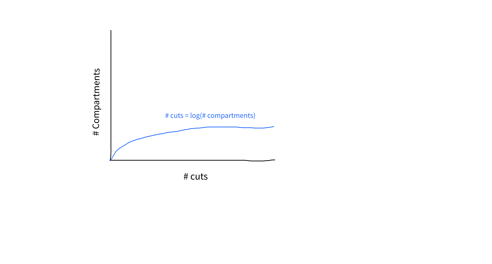

<br />

It might seem silly, but the other day I was asking myself if I really understood what a logarithm is?. If I googled it up, sure, I can remember what it is, but more often than not, I don't think enough about it and eventually forget it.

In this short article I want to write about how we can generate an intuition about what a logarithm is and how it relates to software.

Even though I studied engineering and a ton of math. I have found that I rarely use math on my day to day life and if you don't use something you lose it. (there is no shame in admiting that sometimes I even forget some of the basic math).

> Generating an Intution about logarithms

Imagine you have a cardboard box that has 8 compartments like this

```
Magical cardboard box

[ 1 | 2 | 3 | 4 | 5 | 6 | 7 | 8 ]
```

<br />

and that we have knife that we can use to cut the cardboard box.

Now, lets say we wanted to cut the carboard box in half as many times as we could until it could no longer be cut in half (you can only cut the box where the you see the `|`). It would look something like this

```
[ 1 | 2 | 3 | 4 | 5 | 6 | 7 | 8 ] <- Initial box
[ 1 | 2 | 3 | 4 ]                 <- After first cut
[ 1 | 2 ]                         <- After second cut
[1]                               <- After third cut
```

<br />

- How much are we splitting the box each time?

**In halves**. (That is where the base 2 comes from when you hear logarithm of base 2. If it were base 3 it would mean each cut can only cut a third of the box at a time)

- What was the original number of comparments?.

**It was 8**

- How many times did we cut the box?.

3 times... **and voila! that is what a logarithm is**

In plain english the logarithm is the number of times we could cut the box (in halves) until we could no longer chop it. In some more mathy terms we would say the logarithm base 2 of 8 is 3.

> How does it look for bigger boxes?

If we had bigger boxes with more compartments you can see that the amount of cuts we could make wouldn't increase too much as the size of the boxes get bigger and bigger.



> How are logarithms related to sofware?

In computers we only have 0s and 1s so you will often not even hear about the base. People generally will always assume you use `base 2`.

If you think about the box as an array and the compartments as the length of the array. Passing that array (box) to a function that searches for a values doing a **binary search**, where you only look at half of the array every iteration (cut). You will find that if the size of the array grows the amount of iterations woudn't increase much to find an element, hence you would be actually traversing the array in a **logarithmic pattern** as the one on the graph above.

> Why should you care?

In terms of performance algorthms that run in logarithmic time are going to be better than algorithms that run in linear time and way better than ones that run in exponential **See the image at the beginning of the article**. (Bare in mind that we can't make all algorithms be logarithmic and also I am not taking into account the space an algorithm might take).

Having this knowledge you can find better ways to write your code either by using data structures that might be better suited for certain problems or applying or creating different types of algorithms.
