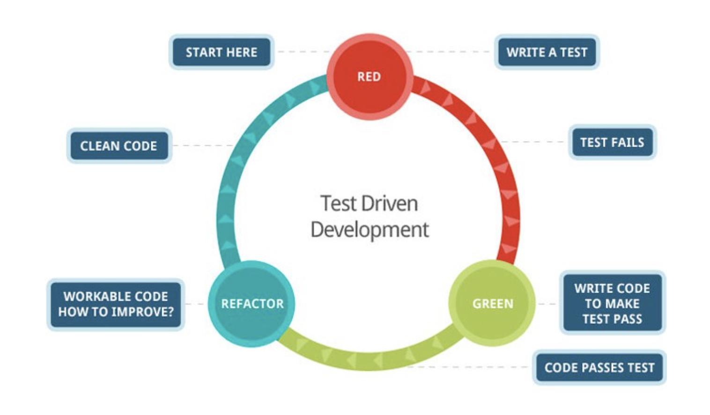

I don't know if many people do it as part of their coding practice, but this year I got it
ingrained in me. Here is why you should start doing it. __PSst If you just care about the code
jump to the bottom of the post__

### Reasons to do Test Driven Development

> Understand the problem and requirements

Writing a test first helps you think about the things that your system needs to support before writing implementations,
and it might even help you uncover some requirements that might have been missed.

This process might also help you start thinking about the design of the code you are about to write. What patterns
should you use?, do I need something from another system?

> They allow you to be dumber

It prevents you from trying to guess how the future will look like and trying to build solutions that might
not even be needed, tests will even tell you what is the next thing you need to implement.

> Refactor with confidence

You could write a test and write some semi decent code to make it pass, and after that,
you can take time to go back and refactor and improve what you did with the confidence that
as long as your tests are passing the functionality remains the same.

> No need for or less documentation 

Having tests can guide other developers on how to use what you just built or
tell them how does it fit into the overall system. (Of course for no documentation there should be other things
in place, but this one is one of them)

> Adds direct value to the business

Tests won't catch every single bug, but they will surely help catch many before someone
in QA does, or a user finds it in production. Having QA spend less time on bugs means they have more
time to focus on exploratory testing and try to figure cooler ways to break the system.


### How to TDD

I will try to keep it short, but I want to demonstrate the process. Here I will be using `Javascript` and `Jest`, but
every programming language has one or more test runners and testing frameworks.

##### The problem

We want to be able to encrypt and decrypt messages. Original messages to be encrypted do not contain numbers.
We encrypt by a simple protocol that is based on character mapping as shown below.

```javascript
// Encryption and decryption happens by replacing 
// vowels by numbers and viceversa
codes = {'a': 1, 'e': 2, 'i': 3, 'o': 4, 'u': 5}

// Examples:
// input = "th3s 3s 1 m2ss1g2." output = "this is a message." 
// input = "another message here!" output = "1n4th2r m2ss1g2 h2r2!"
```

<br/>

1) Start by defining some test cases, just adding the names and think about the cases for
a few minutes. __This will help you think about boundaries, and some scenarios you might not have initially
considered, have you jumped directly into the writing code__

```javascript
describe('Encryption', () => {
  // Here I am thinking about my boundary cases
  it('no message', () => {})

  // What is an encrypted string and how does it look?
  it('encrypted to decrypted message', () => {})

  // What is a decrypted string and how would it look if it is
  // decrypted?
  it('decrypted to encrypted message', () => {})

  it("message with spaces _ scenario encrypted to decrypted", () => {})  

  // What happes if we get something like 12345
  it('decrypted values for all supported codes', () => {})

  // What happens if we get parameters outised our testing boundary,
  // codes like 6 or 8?
  it('unsupported encrypted code', () => {})
})
```

<br/>

2) Now start filling your test with what you would input to them and then what you expect

```javascript
describe('Encryption', () => {

  it('no message', () => {
    // Notice my function name might not be perfect `foo` we can worry
    // about that later since as I said tests will give us confidence
    // to refactor it easily
    const anEmptyMessage = ""
    expect(foo(anEmptyMessage)).toEqual("")
  })

  it('encrypted to decrypted message', () => {
    const anEncryptedMessage = "th3s3s1m2ss1g2"
    expect(foo(anEncryptedMessage)).toEqual("thisisamessage")
  })

  it("message with spaces _ scenario encrypted to decrypted", () => {
    const anEncryptedMessage = "th3s 3s 1 m2ss1g2"
    expect(foo(anEncryptedMessage)).toEqual("this is a message")
  })  


  it('decrypted to encrypted message', () => {
    const aDecryptedMessage = "thisisamessage"
    expect(foo(aDecryptedMessage)).toEqual("th3s3s1m2ss1g2")
  })

  it('all encrypted codes decrypted', () => {
    const allEncryptedCodes= "12345"
    const allDecryptedCodes = "aeiou"
    expect(foo(allEncryptedCodes)).toEqual(allDecryptedCodes)
  })

  it('unsupported encrypted code', () => {
      // There are no specific requirements about what to do in this 
      // case on the instructions so maybe we discovered a requirement
      // product missed?. We can make the assumtion for  now that if
      // it is not found then we just return the same value.
      const anEncryptedMessage = "th8s9s6m6ss*g_"
      expect(foo(anEncryptedMessage)).toEqual("th8s9s6m6ss*g_")
  })
})
```

<br/>

3) At this point you should have a pretty good idea about the problem domain and can start writing code. You
can be dumb and just let your tests guide you. Let's start by making our first test pass.

 ###### Make no message test pass

```javascript
function foo(message) {
  return ""
}
```

###### Make encrypted message to decrypted message pass

```javascript
function foo(message) {
  if (!message) return ""

  const codes = {'a': 1, 'e': 2, 'i': 3, 'o': 4, 'u': 5}
  return a.split('').map((char) => codes[char] ?? char)
}
```

###### Make decrypted to encrypted message pass

```javascript
function foo(message) {
  if (!message) return ""

  const codes = {
      'a': 1, 'e': 2, 'i': 3, 'o': 4, 'u': 5,
      '1': 'a', '2': 'e', '3': 'i', '4': 'o', '1': 'u'
  }
  return a.split('').map((char) => codes[char] ?? char)
}
```

<br />

If we were to run our tests, we will see all of our tests are passing at this point. __The code is
very simple and might not be very open for modification, but it fulfills the requirement  by writing the 
minimum amount of code__.

4) Ok, now that all our tests are passing we can decide to refactor. This process that we have followed is
what you might have heard about called __Red, Green, Refactor__. So we were red when our tests were failing,
then green when we made them all pass and now we are going to refactor them just a bit.



<br />

```javascript
// As I mentioned earlier, the name foo is not very descriptive so
// lets fix we could use cypher which is a term that already
// exists that means an algo that performs decryption or encryption

// To do this refactor, I just used refactoring tools provided by
// my IDE, just hit refactor rename and Voila! done. Still all
// tests pass
function cypher(message) {
  if (!message) return ""

  const codes = {
      'a': 1, 'e': 2, 'i': 3, 'o': 4, 'u': 5,
      '1': 'a', '2': 'e', '3': 'i', '4': 'o', '1': 'u'
  }

  return a.split('').map((char) => codes[char] ?? char)
}
```

<br />

That is it!. You TDD a simple problem, and I know you might be cringing about not
passing codes as a parameter or doing some more refactoring, but avoid refactoring until
you actually need to. __Why should you add complexity and more abstractions yet, if there is
still no business requirement for it?__

#### Additional Resources

One really great book I recommend reading that explain all this process in way more detail is
[99 Bottles of OOP](https://sandimetz.com/99bottles)  by Sandy Metz. It will greatly transform the way you write code if
you follow what she teaches.