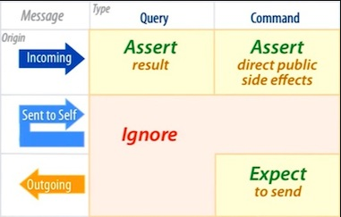

<div style="display: flex; justify-content: center;">
  
</div>

<br/>

> Either you test your code, or your users will. Take your pick

Testing can go horribly wrong and become really painful if you don't test the right things. A lot of the times people
decide to skip tests because:

* They have to mock the entire world to test a tiny thing
* Any time they make a change they have to change their tests
* Everything breaks when they make a tiny change
* Testing is going to make our velocity go down  
* Why do I have to write a test if my code is already working?
* Only junior developers write tests
* I am a programming **God**, test is for the weak


... Just to name a few...

To be honest I have been there before. Testing seemed very tedious. I had
to mock a bunch of things and writing the test was harder than writing the actual code. Instead of blaming on the tests,
why not listen to them?. More often than not, when writing tests becomes really hard it's just a sign that something in your system
is either bad designed or coupled; parts of your code are too dependent on other parts of your code, or the tests you have written are
coupled to the implementation.

Sandi Metz gave a fascinating talk about this topic back in 2013 (check it out below), and even though she focused mostly
on unit testing, I believe her teachings still stand for other types of tests like integration tests.

`youtube:https://www.youtube.com/watch?v=URSWYvyc42M&t=89s`

In her talk she provided a matrix that separates the interactions with methods in terms of the
[Command Query Separation Principle (CQS)](https://en.wikipedia.org/wiki/Command%E2%80%93query_separation) and refers to
calls and responses to/from methods as incoming and outgoing messages respectively. For instance, if we had a class called `Person`,
it could have a method called `get_name` which does not change internal state of a person but returns a value (Query), 
a method called `set_name` which changes a Person's instance name but does not return a value (Command) and we could
`dispatch` messages to the person instance by calling the methods `person.get_name` or `person.set_name('Nelson')` which would
generate an incoming message that will be *Query* or a *Command* respectively.



Here  is an example

```typescript
class EventPublisher {
  static publish<P>(name: string, payload: P): void {
    // ... post and event to message distribution system
    // (rabbitmq, reddis, kafka.. etc etc)
  }  
}

class Person {
  constructor(private name: string) {}
  
  // Calling this will create an Incoming Query
  public get_name(): string {
    return this.name
  }
  
  // Calling this will create an Incoming Message
  public set_name(name: string): void {
    this.name  = name
    // This would be an outgoing command
    EventPublisher.publish("NAME_CHANGED", { name })
  }
}
```
<br/>

> So what should I test?

If you check the matrix 

* When dispatching a query (which could be a call to a controller that queries the database
but does not modify any value), we should test just the value returned.

* When dispatching a command instead of checking internal implementation inside the Person object and
using mocks to check if things get called. We would dispatch the command and then call `get_name`
and assert against the public API the object exposes.

* You should IGNORE testing private methods (both queries and commands) which are the messages the person class 
is sending to itself. Essentially if a public method calls some other private methods not exposed on the public API,
simply ignore that.

* For commands that generate an outgoing message (for example a method that might publish an event),
expect that the method was called or sent. In these cases you could use dependency injection to assert something was called or
other strategies like using test doubles.
  
> My testing philosophy 

In a lot of places you are most likely going to see people talk about the testing pyramid


so most developers are encouraged to write tiny unit tests that test the public interfaces of
their classes and try to achieve the ultimate goal of 100% test coverage. I decide to subscribe to a
different idea... As Kent C Dodds describes on his article [Write tests. Not too many. Mostly Integration](https://kentcdodds.com/blog/write-tests)

> as you move up the pyramid, the confidence quotient of each form of testing increases.

From my experience having more integration tests that show how things interact with each other will 

* Make testing easier (after setting the tooling for testing), since you will have less mocks
* Give you a higher confidence that your system works since you are testing from the clients perspective
* Allow you to refactor your code with more freedom without breaking tests because you renamed things like a method or class name


##Conclusion

From all that I have said here the most important takeaways are

* Test against the public interface 
  (if a client can't see it then your test should not know it exists)
* Call and assert the things the client can interact with.
    * If you have a class then it is the public interface
    * If you have a system test against the controllers
    * If you have a UI interact with the button and assert 
      what the user should see after interacting with something
* Your test should focus on behaviors like
    * Test ordering one item and then removing it
* Focus on testing the boundaries (where conditions change)

I will be writing more post on some detailed strategies to do exactly
what I am describing for both the backend and front end, but until the next time,
I hope you find this helpful :D.


